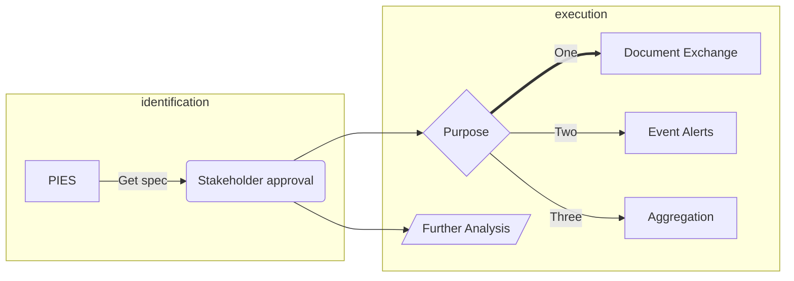

# Markdown Features

Docusaurus supports **[Markdown](https://daringfireball.net/projects/markdown/syntax)** and a few **additional
features**.

## Front Matter

Markdown documents have metadata at the top called [Front Matter](https://jekyllrb.com/docs/front-matter/):

```text title="my-doc.md"
// highlight-start
---
id: my_doc_id
title: My document title
description: My document description
slug: /my-custom-url
tags:
  - developer
---
// highlight-end

## Markdown heading

Markdown text with [links](./hello.md)
```

We recommend that all markdown pages should have at minimum a `title`, `description` and `tags` array defined. An `id`
may be specified, but can be derived off of the filename when omitted.

:::info
A complete listing of Docusaurus supported front matter fields can be found [here](https://docusaurus.io/docs/api/plugins/@docusaurus/plugin-content-docs#markdown-front-matter).
:::

## Links

Regular Markdown links are supported, using url paths or relative file paths.

```md
Let's see how to [Create a page](/create_a_page).
```

```md
Let's see how to [Create a page](./create_a_page.md).
```

**Result:** Let's see how to [Create a page](./create_a_page.md).

## Images

Regular Markdown images are supported.

You can use absolute paths to reference images in the static directory (`static/img/docusaurus.png`):

```md

```


You can reference images relative to the current file as well. This is particularly useful to colocate images close to
the Markdown files using them:

```md

```

## Code Blocks

Markdown code blocks are supported with Syntax highlighting.

````md
```jsx title="src/components/HelloDocusaurus.js"
function HelloDocusaurus() {
  return <h1>Hello, Docusaurus!</h1>;
}
```
````

```jsx title="src/components/HelloDocusaurus.js"
function HelloDocusaurus() {
  return <h1>Hello, Docusaurus!</h1>;
}
```

## Admonitions

Docusaurus has a special syntax to create admonitions and callouts:

```md
:::tip My tip

Use this awesome feature option

:::

:::danger Take care

This action is dangerous

:::
```

:::tip My tip

Use this awesome feature option

:::

:::danger Take care

This action is dangerous

:::

## Mermaid Graphs

Our Docusaurus instance supports **diagramming and charting** through [Mermaid](https://mermaid.js.org). The following
are some quick examples that can be achieved using Mermaid. For more details on the wide range of charts supported,
visit their [documentation](https://mermaid.js.org/intro/) for more details under the **Diagram Syntax** section on the
sidebar.

### State Machine

````text

````


### Flowchart

````text

````


## MDX and React Components

[MDX](https://mdxjs.com/) can make your documentation more **interactive** and allows using any **React components
inside Markdown**:

```jsx
export const Highlight = ({children, color}) => (
  <span
    style={{
      backgroundColor: color,
      borderRadius: '20px',
      color: '#fff',
      padding: '10px',
      cursor: 'pointer',
    }}
    onClick={() => {
      alert(`You clicked the color ${color} with label ${children}`)
    }}>
    {children}
  </span>
);

This is <Highlight color="#25c2a0">Docusaurus green</Highlight> !

This is <Highlight color="#1877F2">Facebook blue</Highlight> !
```

export const Highlight = ({ children, color }) => (
  <span
    style={{
      backgroundColor: color,
      borderRadius: '20px',
      color: '#fff',
      padding: '10px',
      cursor: 'pointer'
    }}
    onClick={() => {
      alert(`You clicked the color ${color} with label ${children}`);
    }}
  >
    {children}
  </span>
);

This is <Highlight color="#25c2a0">Docusaurus green</Highlight> !

This is <Highlight color="#1877F2">Facebook blue</Highlight> !
