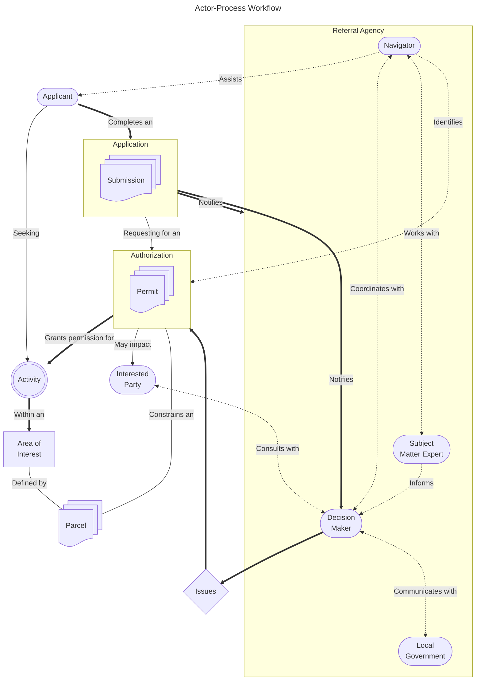

This page provides an overview and guide to the PIES resources, operations and concepts used for representing and
communicating coded, structured data within this specification. Collectively, these concepts are used to provide a
common definition and framework for traversing the coded concepts within PIES.

## Acronyms

| Term | Definition |
| --- | --- |
| LOB | Line of Business |

## Concepts

The following terms outline the main concepts used within this specification and aim to provide a common lexicon for
understanding and terminology usage.

### Actors

This section discusses the various roles that a person, group or an organization may act as within the context of PIES.

| Term | Definition |
| --- | --- |
| Applicant | A person, group or organization seeking an authorization to perform a set of activities. |
| Decision Maker | A statutory decision maker (SDM) are the persons with designated authority by their respective Ministry legislation to issue authorizations, approvals, and similar decisions. |
| Interested Party | A person, or group which may be impacted by an authorization decision. |
| Local Government | A Municipality or Regional District within the Province. They are the entity providing development, use and building approval on a parcel within their jurisdiction. |
| Navigator | An established role which focuses on delivering dedicated support to applicants on application submissions. |
| Proponent | A synonym for an applicant. |
| Referral Agency | A provincial Ministry, local government, or government agency that receives notices for an application. They may be given the opportunity to provide input and comments on an application. |
| Subject Matter Expert | A subject matter expert (SME) is a specialist of a specific domain, such as authorization processes, software, and policy. |

### Definitions

This section outlines the definitions and common vocabulary used for representing specific concepts within PIES.

| Term | Definition | ??? |
| --- | --- | --- |
| Activity | A single, specific defined intent of action an area of intent. An activity may require one or more authorizations, e.g., a housing development project. | |
| Activity Bundling | The act of identifying the set of permits required for a certain activity. | This should be refined, not sure if this should belong here as it's not a formal process but a description of a relationship |
| Application | A submitted form(s) with the intent to obtain or amend an authorization. | This might be getting muddled with the concept of a project. |
| Area of Intent | A set of one or more parcels which define the location(s) an activity is to be performed. | |
| Authorization | The act of granting permission to perform a specific activity in a parcel within the Province of BC. Authorizations may take various forms, including a permit, license, tenure, lease, right-of-way, agreement, grant, statutory right, interest or title. | We might need to expand this definition over time as this is the formal umbrella  term for many things. |
| Caseload | Work happening with the LOB to facilitate, capture and maintain a permit. | |
| Disposition | The final decision or outcome made by a statutory decision maker regarding an application. It essentially indicates what action has been taken with respect to the application, and can be represented by a state. | First attempt at defining - needs review |
| Parcel | A polygon representation of a designated area, location or jurisdiction. Parcels may have varying degrees of accuracy which may or may not come from surveyor submissions. | Rephrased from LTSA page |
| Permit | An official document which grants permission to carry out a specific activity, such as land use, in a parcel within the Province of BC. In the context of permitting modernization, it is being used as a term for any type of authorization. | |
| Project | A set of applications required for a permit | Is this a fancy synonym for an activity bundle? |
| Submission | The completed output of a single form as answered by an applicant. | Add a note like "Submissions require an adjective declaring their application context"? |
| Workload | A quantifiable measurement of the number of client-driven applications in the queue. | |

The following diagram outlines a high level relational map between all the actors (with rounded borders) and how they
interact with specific parts of the process.

### Process Tracking

This section outlines the definitions and common vocabulary used for representing specific concepts within a process.

| Term | Definition | ??? |
| --- | --- | --- |
| Lifecycle | Represents the complete ordered sequencing of phases that an application and an authorization may pass through. A lifecycle should describe the entire scope of processing that can occur from beginning to end. | Highest level concept; answers the "why" |
| Phase | A distinct period or division within a lifecycle. A phase will represent a broader set of stages and usually comes with specific objectives or outcomes. A phase shall be a defined member of a specific lifecycle. | Defines an ordering of related stages. |
| Stage | A discrete, ordered set or collection of states. A stage defines a sequential order of states that the process must go through. A stage shall be a defined member of a phase. | Provides an ordering of higher level states within a phase of work |
| State | A description of the current condition of an application or authorization within the larger process or workflow (e.g., "Submitted", "Approved"). A state shall map to a broader stage definition. | Larger general "where is this at" concept |
| Status | A description of the current condition or update of an application or authorization. Additional details about the current state are typically conveyed (e.g., "Pending Review", "Under Inspection"). All defined statuses shall have a mapping to a broader state definition. | Detailed "what is happening now" concept |

The following diagram outlines a high level categorization map between all of the process terms and how they relate to
each other.

## Structure

The following terms describe the structural definitions of the specification ordered from specific to general.

| Term | Definition |
| --- | --- |
| Data Type | A primitive data type is one of the most fundamental principles for defining what type of information a piece of data is. Common data types are: boolean, integer, string, and date. |
| Identifiers | Identifiers provide a shorthand way to reference a unit of data or a specific entry in a codelist or classification scheme. Typically identifiers are intended to be unique within a local or global context (UIDs, and UUIDs). This can include both UUIDs intended to serve as their own widely used standards as well as commonly used code lists and classification schemes. For example, "CA" is the ISO 3166-1 alpha-2 code for Canada while 515112 is the North American Industry Classification System (NAICS) code for FM radio stations. |
| Vocabulary | A vocabulary establishes standardized terms with consistent semantic definitions. These are typically constrained to a particular namespace or domain. The terms are the machine readable labels for individual data elements or a group of data elements. They can be thought of as the column headings in a spreadsheet of tabular data along with their definitions in a data dictionary. For example, the Dublin Core Metadata Initiative establishes a term and definition for a variety of common metadata elements like "publisher." |
| Schema | A schema can be a data model or database schema defining relationships between different pieces of information. Schemas can be described using SQL, UML, XSD, or JSON Schema. |
| Format | The format or "serialization format" is the syntax, encoding, and file format or media type for storing or transmitting your data. On the web, formats are associated with standardized media type identifiers, like application/json. Common data formats include JSON, CSV, and XML. |
| API | An application programming interface (API) is a predefined protocol for reading and/or writing data using a filesystem, a database, or across a network. Common types of data APIs include OBDC and SQL for databases and REST APIs for the web. |
