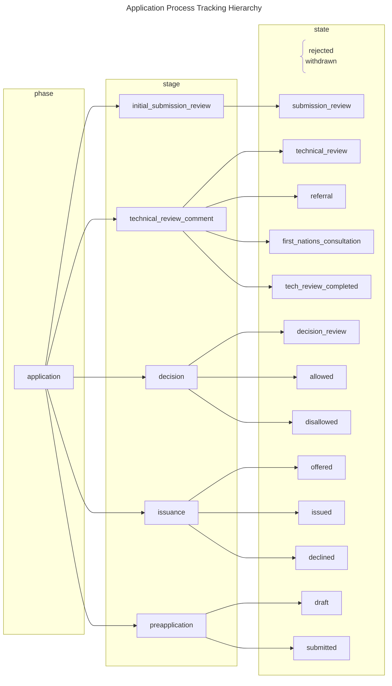

Official URL: `https://bcgov.github.io/nr-pies/docs/spec/code_system/application_process`

This Code System is used or referenced by:

- Code System: [Process Tracking](/docs/spec/code_system/process_tracking)

## Definition

A type of [Process Tracking](/docs/spec/code_system/process_tracking) scoped to Application Process Tracking.

## Content

### Ontology

### Concepts

| Level | Code                         | Display                    | Description |
| ----- | ---------------------------- | -------------------------- | ----------- |
| 3     | `allowed`                    | Allowed                    |             |
| 2     | `decision`                   | Decision                   |             |
| 3     | `decision_review`            | Decision Review            |             |
| 3     | `declined`                   | Declined                   |             |
| 3     | `disallowed`                 | Disallowed                 |             |
| 3     | `draft`                      | Draft                      |             |
| 3     | `first_nations_consultation` | First Nations Consultation |             |
| 2     | `initial_submission_review`  | Initial Submission Review  |             |
| 2     | `issuance`                   | Issuance                   |             |
| 2     | `preapplication`             | Pre-Application            |             |
| 3     | `offered`                    | Offered                    |             |
| 1     | `application`                | Application                |             |
| 3     | `referral`                   | Referral                   |             |
| 3     | `submission_review`          | Submission Review          |             |
| 3     | `submitted`                  | Submitted                  |             |
| 3     | `tech_review_completed`      | Technical Review Completed |             |
| 2     | `technical_review_comment`   | Technical Review Comment   |             |
| 3     | `technical_review`           | Technical Review           |             |
| 3     | `issued`                     | Issued                     |             |

## Errata

Old Process Tracking Examples

These are old Process Tracking hierarchy concepts. While useful as an orientation guide, they no longer reflect the
latest code words that are used in the specification.

