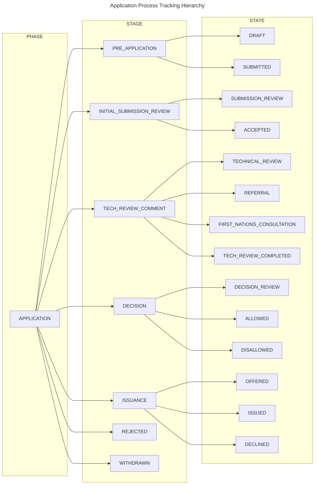
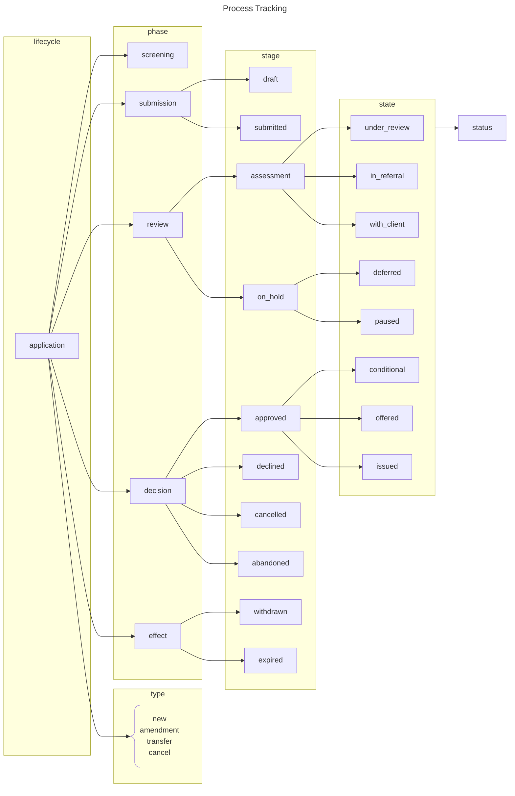
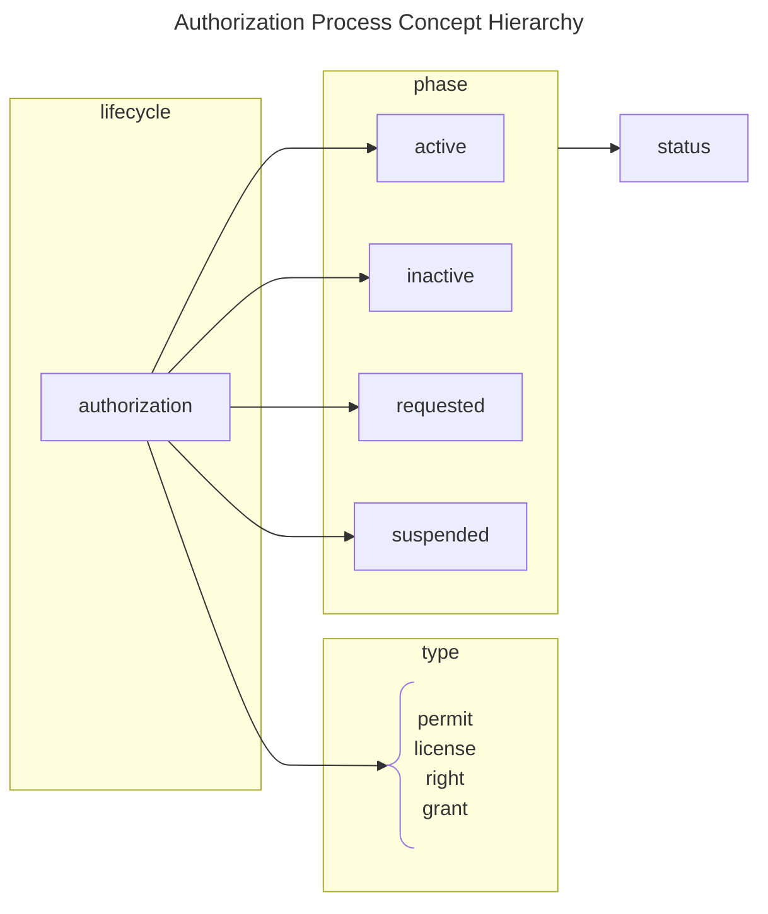

Official URL: `https://bcgov.github.io/nr-pies/docs/spec/code_system/application_process`

This Code System is used or referenced by:

- Code System: [Process Tracking](/docs/spec/code_system/process_tracking)

## Definition

Represents a [Process Tracking](/docs/spec/code_system/process_tracking) classifcation, tracking an authorization
through its entire lifecycle from application, issuance, amendments/extensions, until closure/removal of the
authorization.

## Content

### Ontology

```mermaid
---
title: Application Process Tracking Hierarchy
---

flowchart LR
  PRE_APPLICATION --> DRAFT
  PRE_APPLICATION --> SUBMITTED

  APPLICATION --> PRE_APPLICATION
  APPLICATION --> INITIAL_SUBMISSION_REVIEW
  APPLICATION --> TECH_REVIEW_COMMENT
  APPLICATION --> DECISION
  APPLICATION --> ISSUANCE
  APPLICATION --> REJECTED
  APPLICATION --> WITHDRAWN

  INITIAL_SUBMISSION_REVIEW  --> SUBMISSION_REVIEW
  INITIAL_SUBMISSION_REVIEW  --> ACCEPTED

  TECH_REVIEW_COMMENT --> TECHNICAL_REVIEW
  TECH_REVIEW_COMMENT --> REFERRAL
  TECH_REVIEW_COMMENT --> FIRST_NATIONS_CONSULTATION
  TECH_REVIEW_COMMENT --> TECH_REVIEW_COMPLETED

  DECISION --> DECISION_REVIEW
  DECISION --> ALLOWED
  DECISION --> DISALLOWED

  ISSUANCE --> OFFERED
  ISSUANCE --> ISSUED
  ISSUANCE --> DECLINED

  subgraph PHASE
   APPLICATION
  end

  subgraph STAGE
    PRE_APPLICATION
    INITIAL_SUBMISSION_REVIEW
    TECH_REVIEW_COMMENT
    DECISION
    ISSUANCE
    REJECTED
    WITHDRAWN
  end

  subgraph STATE
    DRAFT
    SUBMITTED
    SUBMISSION_REVIEW
    ACCEPTED
    TECHNICAL_REVIEW
    REFERRAL
    FIRST_NATIONS_CONSULTATION
    TECH_REVIEW_COMPLETED
    DECISION_REVIEW
    ALLOWED
    DISALLOWED
    OFFERED
    ISSUED
    DECLINED
  end
```

### Concepts

| Level | Code                         | Display                      | Description                                                                                                                                                                                                                                                                                                                               |
| ----- | ---------------------------- | ---------------------------- | ----------------------------------------------------------------------------------------------------------------------------------------------------------------------------------------------------------------------------------------------------------------------------------------------------------------------------------------- |
| 3     | `ACCEPTED`                   | Accepted                     | The application has been accepted by the initial reviewing authority.                                                                                                                                                                                                                                                                     |
| 1     | `APPLICATION`                | Application                  | Indicates that the authorization is currently undergoing the application process e.g. creating, vetting, evaluating... and has not yet been issued.                                                                                                                                                                                       |
| 3     | `ALLOWED`                    | Allowed                      | The application has met all requirements, and the decision has been made to allow to move forward with the request.                                                                                                                                                                                                                       |
| 3     | `DECISION_REVIEW`            | Decision Review              | The application has made it past the technical review and comment and slated for final decision.                                                                                                                                                                                                                                          |
| 2     | `DECISION`                   | Decision                     | The designated decision-maker considers the record and issues a determination (e.g., allow, disallowed)                                                                                                                                                                                                                                   |
| 3     | `DECLINED`                   | Declined                     | The applicant has declined the offer proposed by the issuing agency. Further changes to the offer may occur to be reviewed prior to finally being declined or issued.                                                                                                                                                                     |
| 3     | `DISALLOWED`                 | Disallowed                   | The request has not met all requirements, conflicts with other uses or is non-compliant with regulations. Has been officially denied. The applicant is notified of the decision.                                                                                                                                                          |
| 3     | `DRAFT`                      | Draft                        | The application is being prepared but has not yet been submitted. The applicant can make changes.                                                                                                                                                                                                                                         |
| 3     | `FIRST_NATIONS_CONSULTATION` | First Nations Consultation   | The application has been sent off for consultation. This may occur at the same time as being reviewed by the primary authority.                                                                                                                                                                                                           |
| 2     | `INITIAL_SUBMISSION_REVIEW`  | Initial Submission Review    | Upon submission, the receiving office or intake system performs preliminary (often automated) checks for completeness and basic eligibility, validates required documents/fees, and requests corrections if needed. No formal technical assessment occurs here; this stage only determines readiness to enter Technical Review & Comment. |
| 2     | `ISSUANCE`                   | Issuance                     | The application is prepared and finalized. Where an offer is required, it is issued and acceptance is recorded; upon meeting any prerequisites, the authorization is issued.                                                                                                                                                              |
| 3     | `ISSUED`                     | Issued                       | The application process is fully completed, approved and offer accepted (if required), and the necessary actions to issue the authorization.                                                                                                                                                                                              |
| 3     | `OFFERED`                    | Offered                      | The application process is fully completed, approved and offer sent out.                                                                                                                                                                                                                                                                  |
| 2     | `PRE_APPLICATION`            | Pre-Application              | No formal submission or review is underway; the file remains entirely with the proponent.                                                                                                                                                                                                                                                 |
| 3     | `REFERRAL`                   | Referral                     | The application is being referred to another relevant authority for review. This may occur at the same time as under review by the primary authority.                                                                                                                                                                                     |
| 2     | `REJECTED`                   | Rejected                     | The reviewing authority requirements not achieved and application has been rejected. The applicant is informed of the reasons.                                                                                                                                                                                                            |
| 3     | `SUBMISSION_REVIEW`          | Submission Review            | The application is being evaluated by the relevant authority or team. This may involve assessment of documents and qualifications.                                                                                                                                                                                                        |
| 3     | `SUBMITTED`                  | Submitted                    | The application has been officially submitted for review. No further changes can be made at this point.                                                                                                                                                                                                                                   |
| 2     | `TECH_REVIEW_COMMENT`        | Technical Review and Comment | Subject-matter evaluation by internal and/or external reviewers (may include referrals and First Nations consultation, where applicable). This stage ends when all required reviews are completed and documented with comments/recommendations.                                                                                           |
| 3     | `TECH_REVIEW_COMPLETED`      | Technical Review Completed   | The application has been reviewed/recommendation and comment. prepared.                                                                                                                                                                                                                                                                   |
| 3     | `TECHNICAL_REVIEW`           | Technical Review             | The application is being reviewed by the primary authority. This may occur at the same time as referrals or consultation.                                                                                                                                                                                                                 |
| 2     | `WITHDRAWN`                  | Withdrawn                    | The application has been withdrawn by applicant. This may occur at any stage prior to issuance.                                                                                                                                                                                                                                           |

## Errata

Old Process Tracking Examples

These are old Process Tracking hierarchy concepts. While useful as an orientation guide, they no longer reflect the
latest code words that are used in the specification.

```mermaid
---
title: Process Tracking
---
flowchart LR
  app_type@{ shape: comment, label: "new
  amendment
  transfer
  cancel" }

  application --> screening
  application --> submission
  application --> review
  application --> decision
  application --> effect
  application --> app_type

  submission --> draft
  submission --> submitted
  review --> assessment
  review --> on_hold
  decision --> approved
  decision --> declined
  decision --> cancelled
  decision --> abandoned
  effect --> withdrawn
  effect --> expired

  assessment --> under_review
  assessment --> in_referral
  assessment --> with_client
  on_hold --> deferred
  on_hold --> paused
  approved --> conditional
  approved --> offered
  approved --> issued

  state --> status

  subgraph lifecycle
    application
  end

  subgraph type
    app_type
  end

  subgraph phase
    screening
    submission
    review
    decision
    effect
  end

  subgraph stage
    draft
    submitted
    assessment
    on_hold
    approved
    declined
    cancelled
    abandoned
    withdrawn
    expired
  end

  subgraph state
    under_review
    in_referral
    with_client
    deferred
    paused
    conditional
    offered
    issued
  end
```

```mermaid
---
title: Authorization Process Concept Hierarchy
---
flowchart LR
  auth_type@{ shape: comment, label: "permit
  license
  right
  grant"}

  authorization --> active
  authorization --> inactive
  authorization --> requested
  authorization --> suspended
  authorization --> auth_type

  phase --> status

  subgraph lifecycle
    authorization
  end

  subgraph type
    auth_type
  end

  subgraph phase
    active
    inactive
    requested
    suspended
  end
```

