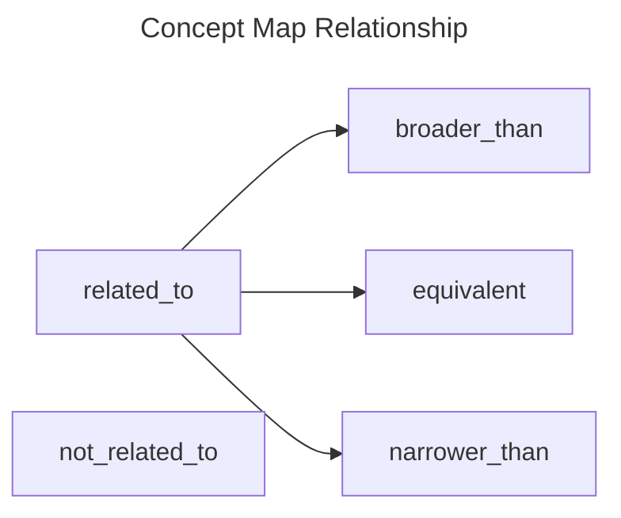

Official URL: `https://bcgov.github.io/nr-pies/docs/spec/code_system/concept_map_relationship`

This Code System is used or referenced by:

- Value Set: [TBD](.)

## Definition

The relationship between concepts.

## Content

### Ontology

### Concepts

| Level | Code             | Display        | Description                                                                                 |
| ----- | ---------------- | -------------- | ------------------------------------------------------------------------------------------- |
| 1     | `related_to`     | Related To     | The concepts are related to each other, but the exact relationship is not known.            |
| 2     | `equivalent`     | Equivalent     | The definitions of the concepts mean the same thing.                                        |
| 2     | `narrower_than`  | Narrower Than  | The source concept is narrower in meaning than the target concept.                          |
| 2     | `broader_than`   | Broader Than   | The source concept is broader in meaning than the target concept.                           |
| 1     | `not_related_to` | Not Related To | This is an explicit assertion that the target concept is not related to the source concept. |

## Errata

This Code System was inspired by the
[HL7 ConceptMapRelationship](https://hl7.org/fhir/codesystem-concept-map-relationship.html). The following is a good
conceptual example of what one of these mappings could look like as a formal Concept Map:
[link](https://fhir-drills.github.io/conceptmap.html#cm-sample-data-mapping)
