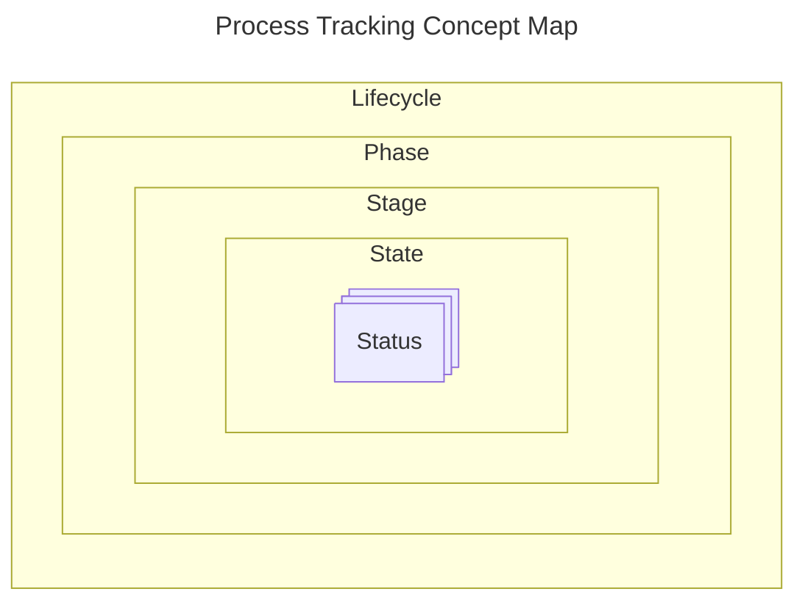

Official URL: `https://bcgov.github.io/nr-pies/docs/spec/code_system/process_tracking`

This Code System is used or referenced by:

- Code System: [Application Process](/docs/spec/code_system/application_process)

## Definition

A conceptual hierarchy for tracking a common process flow.

## Content

### Ontology

### Concepts

| Code        | Display   | Description                                                                                                                                                                                                                                                                                                                                      |
| ----------- | --------- | ------------------------------------------------------------------------------------------------------------------------------------------------------------------------------------------------------------------------------------------------------------------------------------------------------------------------------------------------ |
| `lifecycle` | Lifecycle | Represents the complete ordered sequencing of phases that an application and an authorization may pass through. A lifecycle should describe the entire scope of processing that can occur from beginning to end.                                                                                                                                 |
| `phase`     | Phase     | A distinct period or division within a lifecycle. A phase will represent a broader set of stages and usually comes with specific objectives or outcomes. A phase shall be a defined member of a specific lifecycle.                                                                                                                              |
| `stage`     | Stage     | A discrete, ordered set or collection of states. A stage defines a sequential order of states that the process must go through. A stage shall be a defined member of a phase.                                                                                                                                                                    |
| `state`     | State     | A description of the current condition of an application or authorization within the larger process or workflow (e.g., "Submitted", "Approved"). A state shall map to a broader stage definition.                                                                                                                                                |
| `status`    | Status    | A description of the current condition or update of an application or authorization. Additional details about the current state are frequently conveyed (e.g., "Pending Review", "Under Inspection"). Statuses may be defined by the line of business. All defined statuses shall have a concept mapping to a broader state definition or above. |

## Errata
