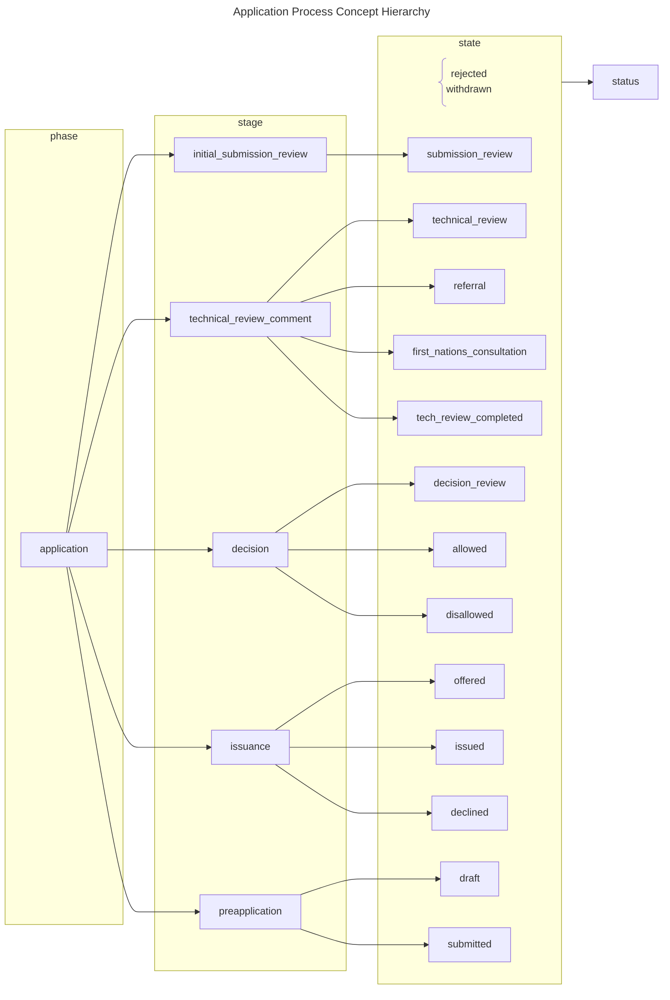

import CodeBlock from '@theme/CodeBlock';

import schema from '@site/docs/spec/codesystem/application_process.codesystem.json';

## Definition

The type of an Application Process Tracking attribute value.

Refer to the [Process Tracking Terminology](/docs/intro/terminology#process-tracking) to understand the definitions
behind each classification level.

## Content

### Ontology

### Concepts

| Code          | Display     | Description                                                              |
| ------------- | ----------- | ------------------------------------------------------------------------ |
| `application` | Application | A submitted form(s) with the intent to obtain or amend an authorization. |

## JSON

<CodeBlock
  language="json"
  showLineNumbers
>
  {JSON.stringify(schema, null, 2)}
</CodeBlock>
