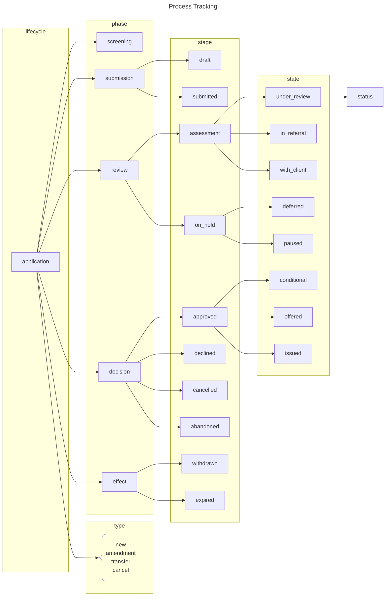
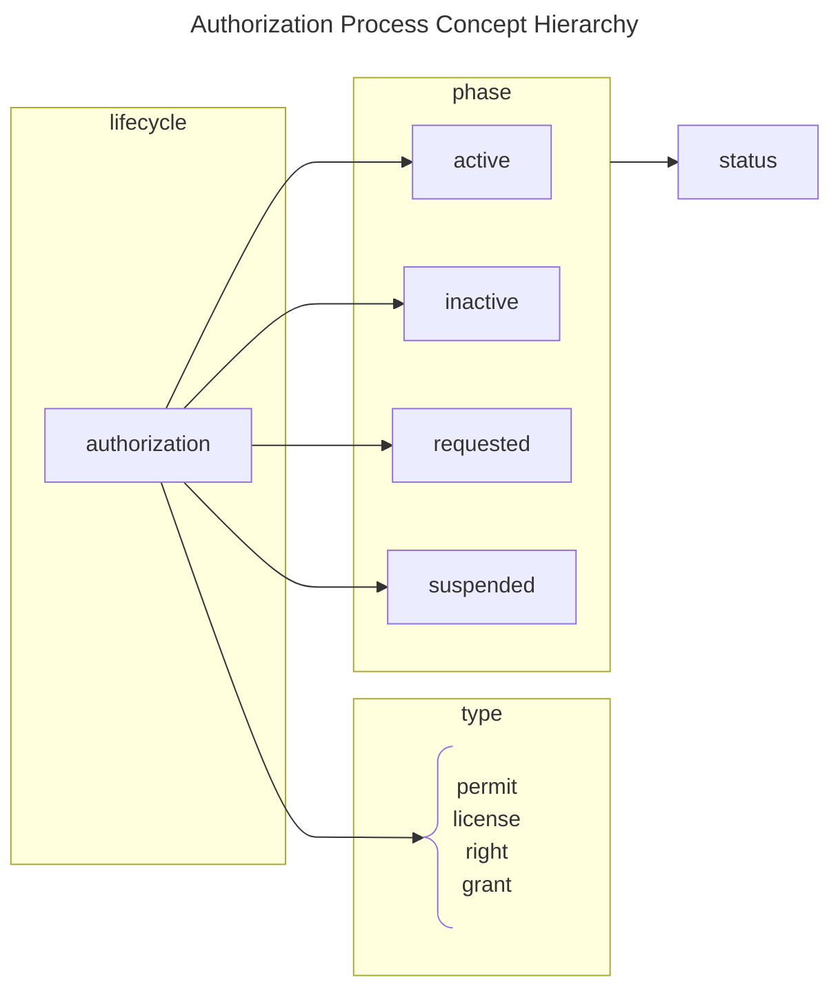

This page outlines the conceptual hierarchy and terminology embeddings which can describe the tracking of a process.

## Classifications

Refer to the [Process Tracking Terminology](/docs/intro/terminology#process-tracking) to understand the definitions
behind each classification level.

## Concept Map

## Code Sets

Each classification within the context of a specific kind of lifecycle will have a codified and enumerated concept. TBD.

### Code Formatting

All classification codes shall be encoded in UTF-8. However, only ASCII characters will be allowed. In a nutshell, the
following characters are allowed:

- **a-z** (lowercase only)
- **0-9** (digits - _Permitted, but discouraged for use in classification codes._)
- **\_** (underscore)

## Type Descriptors

Each kind of lifecycle may be described by a type descriptor. For example, an application may be an amendment type, or
it may be a transfer type. TBD
