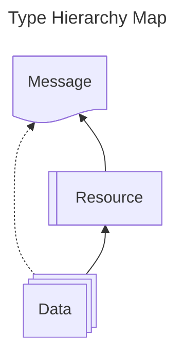

This article outlines PIES specification maturity, type hierarchy, and formatting used by PIES. Topics covered include
the terminology, syntax, encoding and the file format used by PIES, as well as how our type categories relate to each
other.

## Maturity

The PIES specification is still actively being developed. While it has been developed to a point where it may be used
for practical purposes, some areas of the specification will not be as fully defined or have not yet been tested.
Refer to the following table for a description of each maturity level.

| Maturity Level | Emoji | Badge                                                                                                     | Description                                                                                                                                                                                                  |
| -------------- | ----- | --------------------------------------------------------------------------------------------------------- | ------------------------------------------------------------------------------------------------------------------------------------------------------------------------------------------------------------ |
| Deprecated     | ⚠️    |  | This artifact is no longer recommended for use and may be removed in a future release.                                                                                                                       |
| Planning       | 🚧    |         | This artifact is still in the early stages, where brainstorming, research, and organization are taking place. It is not yet ready for use yet.                                                               |
| Draft          | 📝    |               | This artifact has a preliminary structure and is being reviewed for accuracy, completeness, and usability. It could be used, but some areas may still need improvement and may have major changes over time. |
| Trial          | 🔬    |                | This artifact has been developed to a point where it may be used for practical purposes. It may be used, but some areas may still need refinement and may have minor changes over time.                      |
| Standard       | None  |           | This artifact has been fully developed and has been ratified as a part of the standard. It can be used in production environments.                                                                           |

Each artifact in the specification may potentially be suffixed by an emoji indicating their maturity level. In addition,
each artifact's page will also contain a maturity level badge.

## Hierarchy

The PIES specification is organized into a hierarchy of artifacts, each with its own purpose and functionality. The
following table provides an overview of the hierarchy:

| Type Class                                     | Description                                                                                                                                       |
| ---------------------------------------------- | ------------------------------------------------------------------------------------------------------------------------------------------------- |
| [Data](/docs/category/data-types)                 | Represents core, atomic data structures and their inherent attributes or properties.                                                              |
| [Resource](/docs/category/resource-types) | Represents a composed or combined set of data types. The composition defines higher order relational concepts between the data types.             |
| [Message](/docs/category/message-types)           | Represents a composition of resource and data types. Message types are normally used for API based communication between systems or applications. |

### Type Hierarchy

The fundamental idea of the PIES hierarchy is that the fundamental data types can be grouped together into resources
which explain more complex ideas or topics. The resources can then be used to create more complex resource types or
messages. Messages will consist of a mixture of resource and/or data types, and the set of all types within their
definition should create a cohesive chunk of information that can be used for interchange and communication purposes.
The following diagram shows how these types are related to each other:

## Formatting

Every data standard must have a core set of fundamental data types that content will be transmitted in. Since the
Permitting Interoperability Exchange Specification is built on top of the [JSON Schema](https://json-schema.org/)
standard, it will leverage the conventions specified in that standard, including
[RFC 8259](https://datatracker.ietf.org/doc/html/rfc8259) which defines JSON. The PIES specification will be compliant
to the `draft 07` specification of the JSON Schema standard. While there exists more recent draft versions, notably the
`draft 2020-12` standard, features that were introduced after `draft 07` will not be defined and used at this time in
order to maximize compatibility with implementor systems.

### JSON Schema Primer

A JSON Schema is commonly used to define, annotate and verify JSON structured documents and content. It serves as a way
to explicitly define the structural expectations for a specific type of document. While JSON Schema is good for
describing expected structures, describing conceptual relationships between related topics and domains

A JSON Schema will typically contain the following attributes:

- `$schema` - This describes the draft level this JSON Schema complies to.
  - This property value SHALL be `http://json-schema.org/draft-07/schema#`.
  - This must be verbatim, with `http` and the trailing `#`. Any deviations will cause certain parsers like AJV to fail
    to parse correctly.
- `$id` - The unique URI for this schema. The path should ideally contain an obvious versioning nomenclature.
- `$comment` - A free text field for conveying out of band information about the schema. Comments are useful for
  specification readers and editors to understand further nuances for certain properties and structures, but should not
  be relied upon for implementation as they may be skipped over or stripped when parsed by machines.
- `title` - The intent of the schema. This should be brief and concise.
- `description` - A brief description about the schema. This should provide a quick overview for the context of usage.
- `properties` - A set of attributes that are expected to show up in this document type.
- `required` - An array defining the set of `properties` that must be present for the document to be considered valid.
  Anything defined that is not in this array is implied to be optional.
- `type` - The type primitive constraint for the property.

## References

- [Draft 07](https://json-schema.org/draft-07)
- [RFC 8259](https://datatracker.ietf.org/doc/html/rfc8259) (JSON)
- [JSON Schema Version Comparison](https://ajv.js.org/guide/schema-language.html#json-schema)
