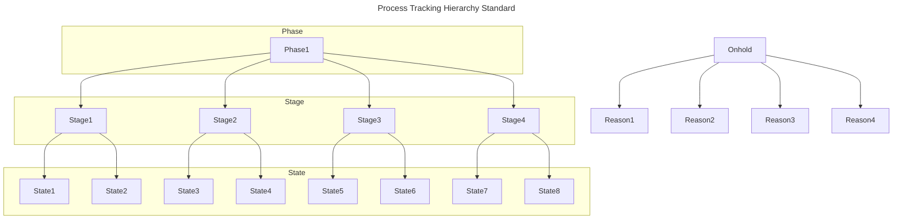
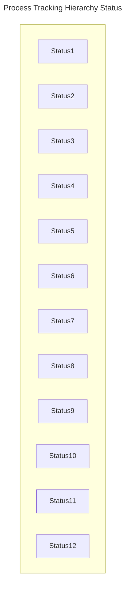
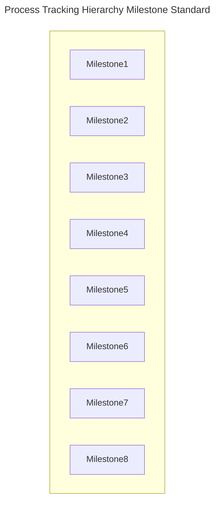

## Objective

Define **one province-wide framework** for standardizing where every authorization is at from initial application to
final closure, by mapping each record to a four-level hierarchy (Lifecycle → Phase → Stage → State) and capturing the
mandatory date/timestamps that mark transitions between each.

**This data element**:

- **Enables standardized process tracking** – the authorization data is stored in a format to allow for the tracking of
  an application through as it progresses until a final decision and then into maintenance of the issued authorization.
- **Ensures a common vocabulary** – the authorization data uses the same controlled lists for Lifecycle, Phase, Stage,
  States for the purposes of process tracking.
- **Ensures mandatory timestamps** – Start/end time-stamps are recorded as the authorization is progressing along its
  lifecycle.
- **Ensures system interoperability** –

**This data element does not**:

- **Track Compliance and Enforcement processes** - out of scope for this standard.

